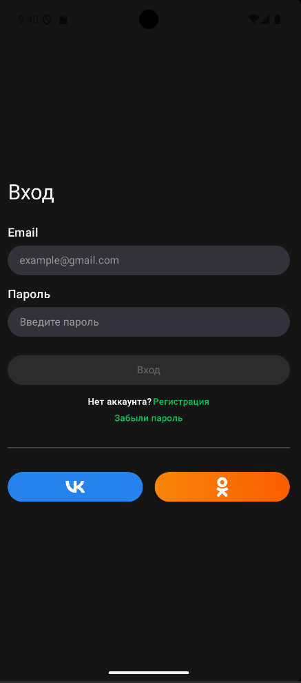
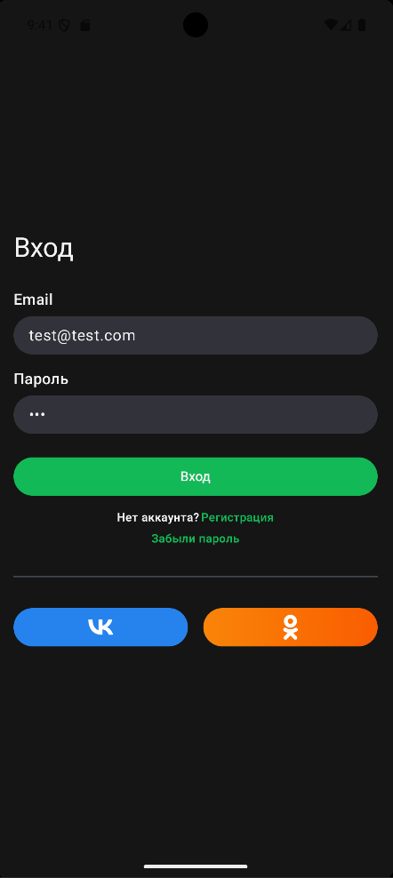
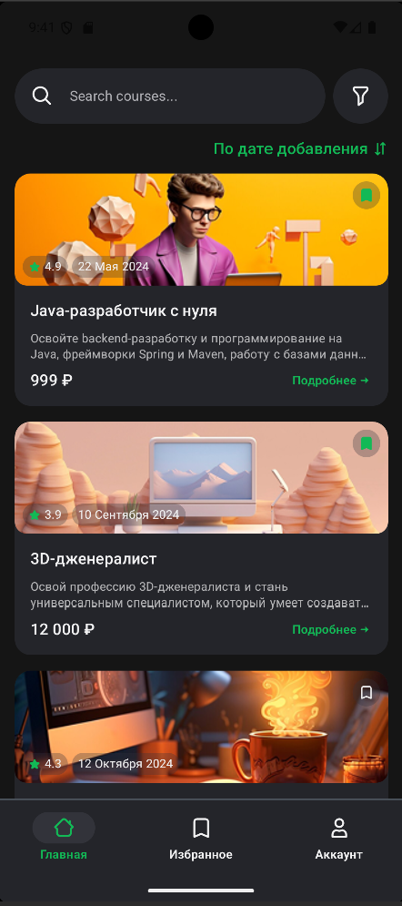
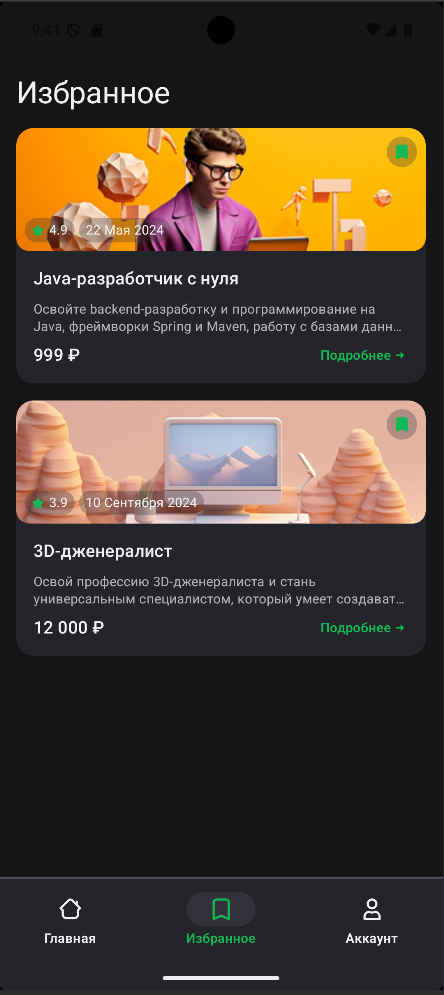

# Тестовое задание

## Логин и пароль для входа:
test@test.com

123

## Стек:
### Kotlin, Jetpack Compose, Material 3, Navigation Compose, Hilt, Retrofit, OkHttp, Kotlinx Serialization, Coroutines, Flow, Room, Coil, Detekt, GitHub Actions

  
  
  
  

